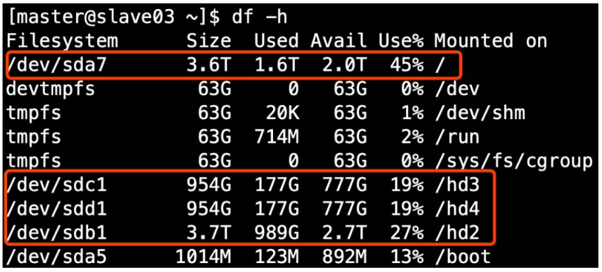

# 配置hdfs存储多目录


在 hdfs-site.xml 文件中配置多目录，注意新挂载磁盘的访问权限问题。

HDFS 的 DataNode 节点保存数据的路径由 `dfs.datanode.data.dir` 参数决定，其默认值为 `file://${hadoop.tmp.dir}/dfs/data`，

若服务器有多个磁盘，必须对该参数进行修改。如服务器磁盘如下图所示，则该参数应修改为如下的值。

```xml
<property>
<name>dfs.datanode.data.dir</name>
<value>file:///dfs/data1,file:///hd2/dfs/data2,file:///hd3/dfs/data3,file:///hd4/dfs/data4</value>
</property>
```

注意：因为每台服务器节点的磁盘情况不同，所以这个配置配完之后，不需要分发。

要根据每台服务器的具体情况配置。




---------------------------
来自：[https://www.bilibili.com/video/BV1df4y1U79z/](https://www.bilibili.com/video/BV1df4y1U79z/)